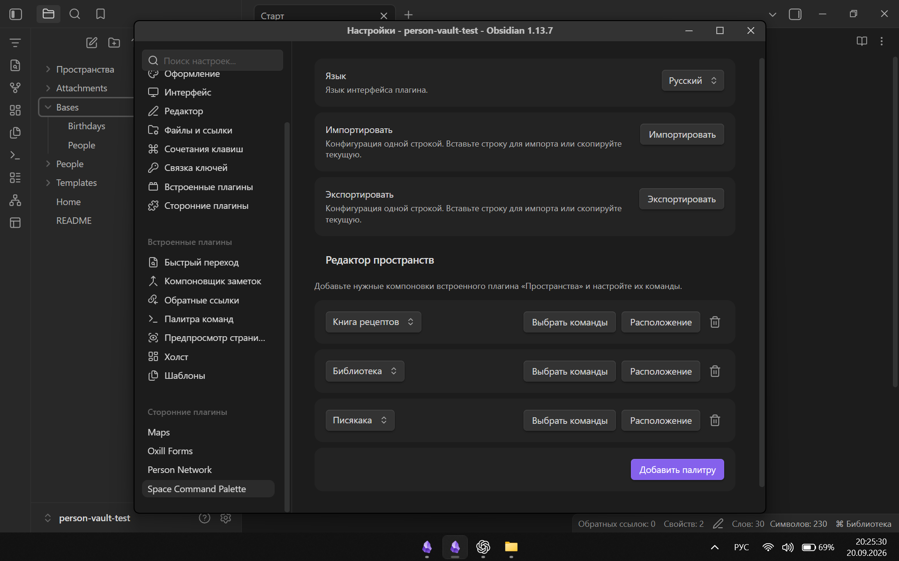
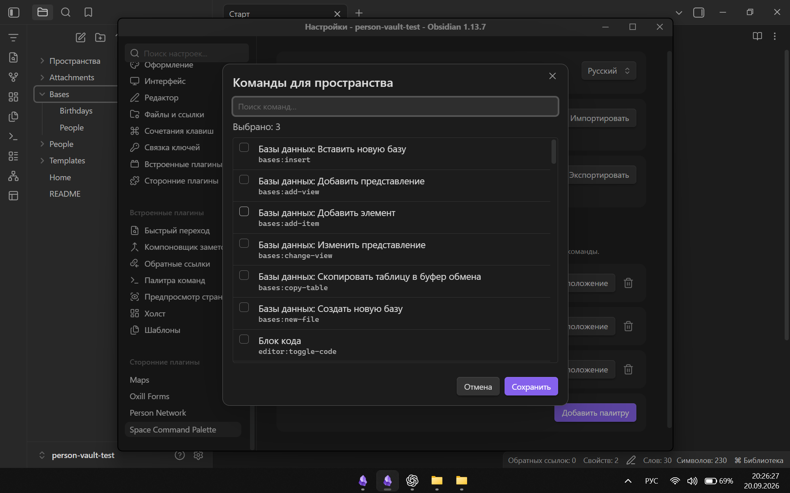

# Space Command Palette

[Русский](#русский) · [English](#english)

## Русский

Контекстная палитра команд для встроенного плагина Obsidian **«Пространства»** (`Workspaces`). Каждая сохранённая компоновка получает собственный набор команд, который включается автоматически при её загрузке.

Возможности: выбор команд Obsidian и сторонних плагинов, настройка порядка, защита от повторных привязок, сохранение настроек удалённого или переименованного пространства, однострочный импорт/экспорт JSON и интерфейс на русском, английском и китайском языках.

Требования: Obsidian 1.13.0+, включённый встроенный плагин **«Пространства»** и хотя бы одна сохранённая компоновка.

Установка: скопируйте `main.js`, `manifest.json` и `styles.css` в `<vault>/.obsidian/plugins/space-command-palette/`, перезапустите Obsidian и включите плагин.

Настройка:

1. Откройте `Настройки → Space Command Palette`.
2. Нажмите **«Добавить палитру»** и выберите пространство.
3. Через **«Выбрать команды»** добавьте нужные команды.
4. Через **«Расположение»** измените порядок или удалите команды.

`Ctrl+Shift+P`, значок в ленте и название в строке состояния открывают палитру активного пространства. Если привязки нет, открывается стандартная палитра Obsidian.

При удалении или переименовании пространства настроенный набор сохраняется и отмечается как отсутствующий. Его можно перепривязать к другой компоновке. Недоступные команды также сохраняются и помечаются в редакторе расположения.

Экспорт копирует конфигурацию одной строкой JSON. Импорт переносит язык, привязки, ID команд и их порядок. Данные хранятся в `.obsidian/plugins/space-command-palette/data.json`; заметки и компоновки плагин не изменяет.

> Obsidian не предоставляет публичный API активной сохранённой компоновки. Плагин использует внутренний экземпляр `workspaces`, поэтому после крупных обновлений Obsidian может потребоваться обновление совместимости.

---

## English

A contextual command palette for Obsidian's built-in **Workspaces** plugin. Each saved layout gets its own command set, activated automatically when that workspace is loaded.

Features include selection of Obsidian and third-party commands, custom ordering, duplicate-binding prevention, preserved settings for renamed or deleted workspaces, single-line JSON import/export, and Russian, English, and Chinese interfaces.

Requirements: Obsidian 1.13.0+, the built-in **Workspaces** plugin enabled, and at least one saved workspace.

Installation: copy `main.js`, `manifest.json`, and `styles.css` into `<vault>/.obsidian/plugins/space-command-palette/`, restart Obsidian, and enable the plugin.

Setup:

1. Open `Settings → Space Command Palette`.
2. Select **Add palette** and choose a workspace.
3. Use **Choose commands** to select its commands.
4. Use **Order** to reorder or remove commands.

`Ctrl+Shift+P`, the ribbon icon, and the status-bar workspace name open the active contextual palette. If no binding exists, Obsidian's standard command palette opens instead.

If a workspace is renamed or deleted, its command set is retained and marked as missing so it can be reassigned. Unavailable commands are also retained and identified in the Order editor.

Export copies the configuration as single-line JSON. Import restores the language, workspace bindings, command IDs, and order. Data is stored in `.obsidian/plugins/space-command-palette/data.json`; the plugin does not modify notes or saved layouts.

> Obsidian has no public API for the active saved workspace. This plugin reads the internal `workspaces` instance, so major Obsidian updates may require a compatibility update.

## License

MIT © 2026 oxill. See [LICENSE](LICENSE).
